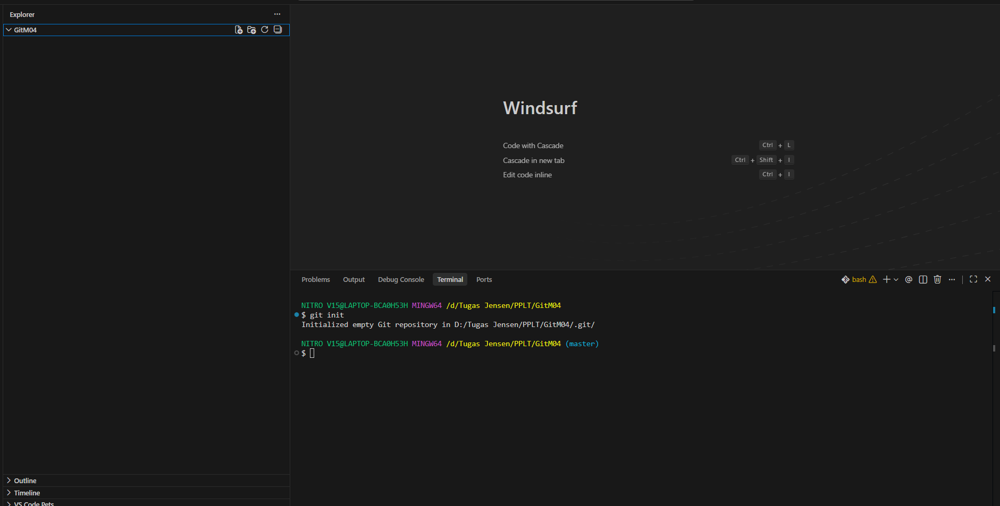
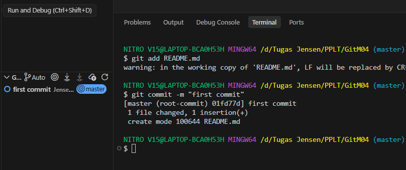
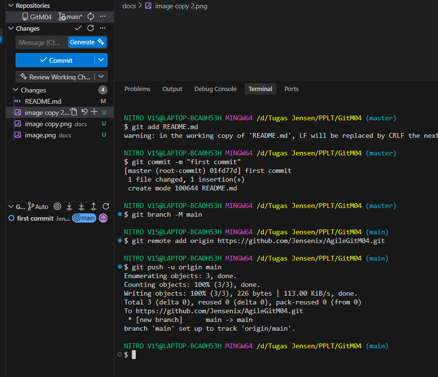
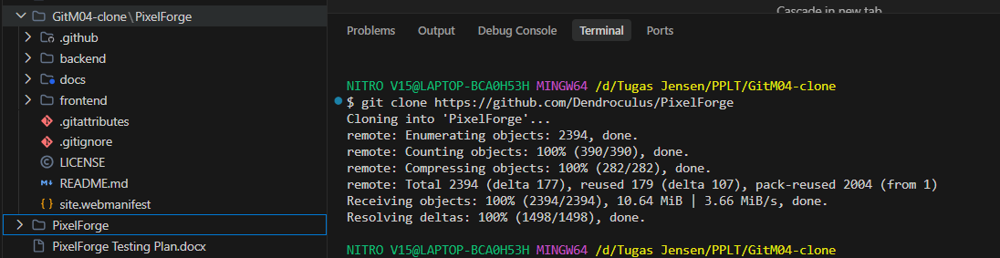

# AgileGitM04 - Git Operations Documentation

## Overview
This repository contains the documentation and implementation of Git operations including initialization, adding files, committing changes, pushing to remote repository, and cloning repositories.

## Git Operations Performed

### 1. Git Init
Initialize a new Git repository in the current directory.



### 2. Git Add
Add files to the staging area for the next commit.


### 3. Git Commit
Create a new commit with the staged changes.



### 4. Git Push
Push local commits to the remote repository.



### 5. Git Clone
Clone a remote repository to the local machine.



## Project Structure
```
GitM04/
├── docs/                      # Screenshots of Git operations
│   ├── init.png              # Git initialization screenshot
│   ├── add READMEmd.png      # Git add operation screenshot
│   ├── commit.png            # Git commit operation screenshot
│   ├── push.png              # Git push operation screenshot
│   └── clone.png             # Git clone operation screenshot
├── README.md                 # This file
└── [other project files]
```

## Commands Used
```bash
# Initialize repository
git init

# Add files to staging
git add .

# Commit changes
git commit -m "Initial commit with Git operations documentation"

# Push to remote
git push origin main

# Clone repository
git clone <repository-url>
```

## Learning Outcomes
- Understanding of Git version control fundamentals
- Experience with basic Git workflow
- Knowledge of repository management
- Familiarity with collaborative development practices

## Author
This documentation was created as part of the PPLT (Pengembangan Perangkat Lunak Tangkas) course to demonstrate practical Git operations.

---

**Last Updated:** 2025-05-07
